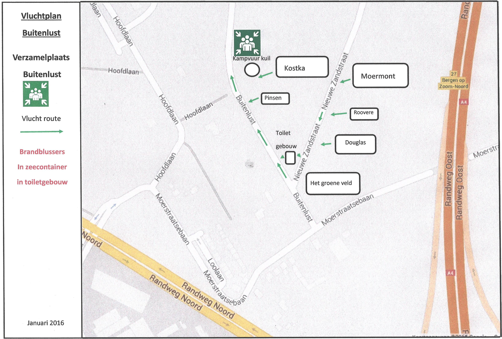

- [Kampeerreglement](#kampeerreglement)
- [Ontruimingsplan](#ontruimingsplan)

## Kampeerreglement

Het kampeerterrein ligt tegen het natuurgebied van ‘het Brabants
Landschap’ en ‘Stichting Scouting Labelterrein Buitenlust’ is eigenaar en
verantwoordelijk voor de coördinatie en het beheer met betrekking tot het
kamperen door leden van Scouting Nederland of aanverwante organisaties.

Het terrein is uitsluitend bestemd voor tentkampeerders van scouting.

De beheerder is als enige bevoegd op het kampreglement uitzonderingen te
maken. In situaties met betrekking tot kamperen, waarin dit reglement niet
in voorziet, beslist ten alle tijden de beheerder

Stichting Scouting Labelterrein Buitenlust kan niet aansprakelijk worden
gesteld voor materiële en of persoonlijke schade welke tijdens de
huurperiode plaatsvindt. De groep (huurder) dient hierin zelf te voorzien in de vorm
van eigen aansprakelijkheid – cq aanvullende verzekering.

Indien door onvoorziene omstandigheden, calamiteiten, overmacht van
buitenaf de verhuur moet worden afgebroken of niet door kan gaan,dit ter beoordeling
van Stichting Scouting Labelterrein Buitenlust (verhuurder) dan zal
en kan de huurder de verhuurder hiervoor niet financieel of persoonlijk
aansprakelijk stellen inzake de hieruit voortvloeiende kosten gemaakt door
huurder.
Stichting Scouting Labelterrein Buitenlust behoud zich het recht voor om
aanwijzingen, aanvullende voorwaarden en voorschiften aan de
huurovereenkomst te verbinden.

**Reservering:**  
De reservering is pas definitief, als de huurovereenkomst terug is bij de
beheerder, de waarborgsom is betaald en door de beheerder een getekende
huurovereenkomst is afgegeven.

**Kampeer kwalificatie:**  
Eén kaderlid per kampeergroep wordt verzocht in het bezit te zijn van de
kampeer kwalificatie van Scouting Nederland.

**Aankomst en vertrek:**  
Bij aankomst dient men zich direct te melden bij de beheerder of de
daartoe aangewezen kampstaf,deze verwijst u naar uw terrein. Bij
aankomst dient u de calamiteitenlijst bij te hebben en af te geven aan de
beheerder. Deze is bedoeld voor calamiteiten en ontruiming van het terrein.
Na afloop van de kampeerperiode wordt de calamiteitenlijst in het kader van
privacy afspraken Scouting Nederland door de beheerder van Stichting Scouting
labelterrein Buitenlust teruggegeven aan de verantwoordelijk leider van de
vertrekkende groep.

Bij vertrek is elke groep verplicht het toegewezen kampeerterrein schoon en opgeruimd
achter te laten. Men kan pas vertrekken indien het kampeerterrein
gecontroleerd is door de beheerder of de daartoe aangewezen kampstaf en
in orde is bevonden.

Het geheel of eventueel restant van de waarborgsom wordt ±
twee weken na uw vertrek terug gestort dit wel na controle en of eventuele
verrekening van schade.

**Schade:**  
Schade toegebracht aan het terrein en/of gebouwen wordt op de
waarborgsom in mindering gebracht. De bedragen staan vermeldt op de
schadelijst in het kantoor van de beheerder.

Overschrijdt de schade de waarborgsom, dan dient het ontbrekende bedrag
te worden bijbetaaldt uiterlijk binnen 4 weken na constatering en na
mondelinge / schriftelijke melding schadeformulier, daarna worden de
wettelijke opslagrente en overige administratiekosten berekend.

**Kampeerterreinen:**  
Kamperen is alleen toegestaan op de daarvoor aangewezen kampeerterreinen.
Voor groepen zijn de volgende terreinen beschikbaar [(zie terein):](/terrein)  
    a. het Groene Veld  
    b. Douglas  
    c. Roovere  
    d. Moermont  
    e. Kostka  
    f. Pinsen  
Het plaatsen van tenten buiten deze terreinen is verboden.

Het terrein Roovere is alleen bestemd voor passanten.
Huisdieren zijn tijdens het kamperen niet toegestaan, met uitzondering van
hulphonden en in overleg met de beheerder .
Iedere vorm van graven op het terrein is verboden.
Open vuren en stookvuren zijn op de kampeerterreinen verboden.
Op het terrein is een kampvuurkuil aanwezig.
Aggregaten zijn verboden.
Op het terrein dient van 23.00 uur tot 07.00 uur volledige rust in acht te
worden genomen.
Het is verboden om bomen te kappen en hout te sprokkelen uit het bos zonder
toestemming van de Beheerder.
Het kappen en beschadigen van (levende) bomen en/of struiken is te
strengste verboden en wordt in rekening gebracht.
Het veroorzaken van geluidsoverlast moet worden vermeden bij omwonenden
en/of bij andere kampeerders op het terrein door een muziekinstallatie,
radio’s of iets dergelijks.
Voor de betreding van de kampeerterreinen dient men in verband met
schade aan de natuur van de vaste paden gebruik te maken. Het is veboden
dat men dwars door het bos loopt, dit is niet gewenst en is
nogmaals niet toegestaan.
Het is verboden met auto’s, motoren of (brom)fietsen door het bos of over
de kampeerterreinen te rijden.
Auto’s, vrachtauto’s, busjes en aanhangers kunnen op de weg worden uitgeladen
en dienen daarna naar de aangewezen parkeerplaatsen gebracht te worden.
Voor veplaatsing van zware materialen zijn twee handkarren en één kruiwagen 
beschikbaar.Deze zijn te verkrijgen bij de beheerder.

**Kampvuurkuil**:  
Het houden van een kampvuur kan uitsluitend alleen in de kampvuurkuil en 
pas na instemming van de beheerder plaatsvinden .
Alle overige vormen van (open) vuur zijn ten strengste verboden. Onder
vuren worden alle vormen van open vuur verstaan.
Bij code 2 mag er niet gestookt worden, zie website
[www.natuurbrandrisico.nl](https://www.natuurbrandrisico.nl/)
Het houden van een BBQ mag alleen met kant en klare houtskool en altijd na
insteming van de beheerder .
Tijdens het kamp- of stookvuur dienen blusmiddelen, waaronder een
brandblusser en een emmer water aanwezig te zijn.
Na gebruik dient de kampvuurkuil weer netjes opgeruimd en schoon
opgeleverd te worden. Het aangebrande hout dient bij de stookplaats
opgelegd te worden.
Uit het oogpunt van veiligheid bij het koken dient elke groep verplicht te
beschikken over een brandblusser. Eventueel kan een branblusser bij de
beheerder worden gehuurd voor € 5,00 per week. Gebruik hiervan wordt in rekening
gebracht.

**Afval:**  
Glas, papier, plastic,blik, batterijen en ander (chemisch) afval dient op de
daarvoor bestemde plaats bij het milieuhok gescheiden ingeleverd te
worden.
Restafval kan alleen in een afgesloten vuilniszak worden aangeboden.
Indien geen container aanwezig is moet in overleg met de beheerder het
gescheiden afval bij het milieu hok worden weggezet.
In de maanden juli en augustus dient er altijd gebruik gemaakt te worden van
de container welke aan de weg staat bij het stafveldje.
Het is verboden tafels, stoelen, banken etc. op het terrein achter te laten of
te deponeren bij de aangewezen afvalplaatsen.

**Sanitair en koelkasten:**  
De centrale was-, douche- en toiletgelegenheid dient uitsluitend voor deze
doeleinden gebruikt te worden, misbruik wordt beboet.
Per kampeerterrein wordt 1 toilet toegewezen. De verantwoordelijk
leider/leidster krijgt hiervan, op borgbasis, een sleutel.
Gedurende de kampeerperiode zijn de bezoekende groepen ten alle tijden
verantwoordelijk voor het ordelijk, net en schoonhouden van het sanitair
gebouw en de toegewezen toilet en (kampeer)terrein.
Het gebruik van chemische toiletten is verboden.
Drinkwater voor de kampeerterreinen kan bij het sanitairgebouw gehaald
worden.
Indien men gebruik wil maken van de douches, kan men tegen betaling,
douchemunten € 0,60 per munt verkrijgen bij de beheerder .
Ten behoeve van het opladen van GSM`s zijn alle toiletten voorzien van
en kluisje met een stopcontact.
Per groep is een afsluitbare koelkast beschikbaar, de kosten hiervan bedragen 
€5,00 per weekend en € 15,00 per week of een deel daarvan vast te stellen
door de beheerder.

**Omgeving:**  
De naburige terreinen van Landgoed Vrederust mogen na 21.00 uur niet meer betreden worden.
Binnen het landgoed Buitenlust (Brabants Landschap) en de gemeentebossen van Bergen op Zoom 
is navolging van de bestaande openstellingregels verplicht.

## Ontruimingsplan

[Hier kunt u het ontruimingsplan dowloaden](../assets/Ontruimingsplan&#32;Buitenlust.pdf)

Op het onderstaand kaartje kun je de vluchtroutes zien.

