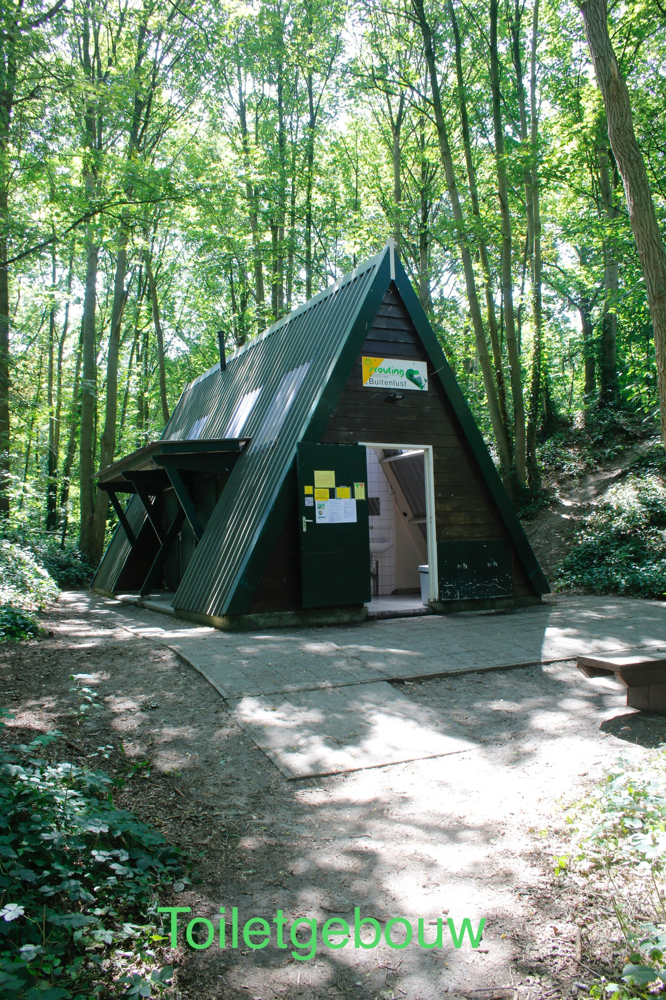

In het bijna 14 hectare bosgebied liggen meerdere kampeervelden tussen de bomen.
Het terrein is van Scouting Labelterrein Buitenlust en vormt een broedplaats
voor vogels. Deze zijn ook waar te nemen op verschillende wijze.  

   
Locatie Labelterrein:  
Buitenlust 11, 4661 AL.  
Halsteren, gemeente Bergen op Zoom  
Geen post adres behalve voor de post aan de groepen

