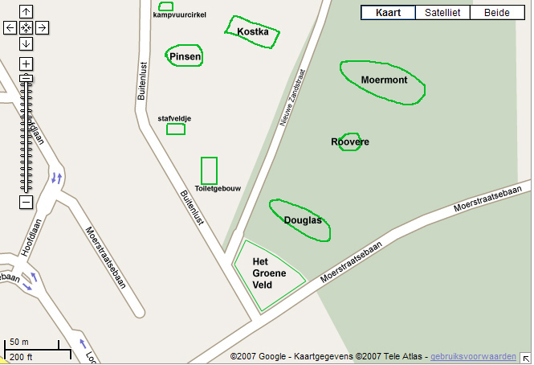
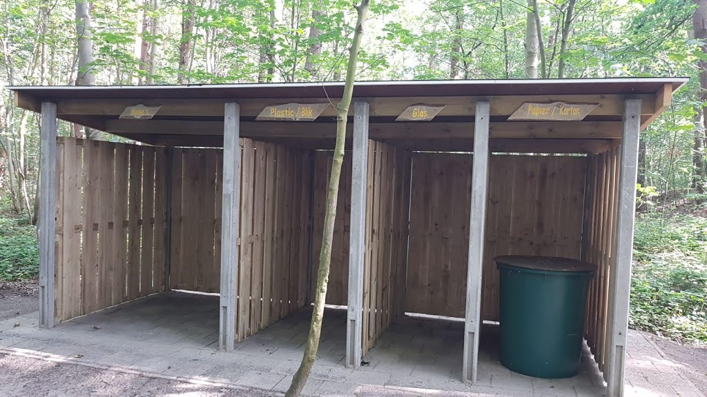

Het terrein is gelegen ten noorden van Bergen op Zoom in een bosrijk gebied en 5,5 ha. groot. Het is licht geaccidenteerd en kent een grote verscheidenheid aan begroeiing. De Nieuwe Zandstraat loopt er doorheen. Zoals de naam al zegt is het een zandweg en vormde jarenlang de grens tussen Bergen op Zoom en de voormalige gemeente Halsteren. Er vindt slechts beperkt verkeer op plaats, in hoofdzaak bestemmingsverkeer naar het achterliggende gebied. [Open in google maps](https://www.google.nl/maps/place/Scouting+Labelterrein+BUITENLUST/@51.5150386,4.2963654,15z/data=!4m13!1m7!3m6!1s0x47c46cadaf209da9:0x29060695bcd6164a!2sBuitenlust,+Halsteren!3b1!8m2!3d51.5169899!4d4.3049768!3m4!1s0x47c41334ebbdcd15:0xee193dfa9d4103e9!8m2!3d51.5125249!4d4.3058154?hl=nl)

Buitenlust is eigendom van "Het Brabants Landschap" en is een prachtig natuurgebied. Vooral voor diverse vogelsoorten die hier leven, is het gebied van levensbelang. Je vindt hier: de houtsnip, wielewaal, nachtegaal, grauwe vliegenvanger, zwarte en gekraagde roodstaart, fluiter, boomkruiper, tjiftjaf, goudhaantje, allerlei mezen, spechten, de ransuil en de steenuil en nog vele andere soorten vogels. Kortom een magnifiek stukje Brabants natuur. Mede daarom kan er vanaf Pasen en de volgende weekeinden in beperkte mate rustig gekampeerd worden (broedseizoen vogels). Vanaf midden mei tot eind oktober is het terrein volledig beschikbaar. Tot half november weer in beperkte mate. Het kampeerreglement is op dit gebied aangepast en wordt na reservering toegezonden.

We hebben de volgende treinen

- [Douglas](http://www.buitenlust.net/images/fotos/SimpleViewer/Douglas/index.html)
- [Het Groene Veld](http://www.buitenlust.net/images/fotos/SimpleViewer/het%20Groene%20Veld/index.html)
- [Kostka](http://www.buitenlust.net/images/fotos/SimpleViewer/Kostka/index.html)
- [Moermont](http://www.buitenlust.net/images/fotos/SimpleViewer/Moermont/index.html)
- [Pinsen](http://www.buitenlust.net/images/fotos/SimpleViewer/Pinsen/index.html)
- [Roovere](http://www.buitenlust.net/images/fotos/SimpleViewer/Roovere/index.html)

Voorzieningen:

- [Kampvuurkuil](http://www.buitenlust.net/images/fotos/SimpleViewer/Kampvuur%20kuil/index.html)
- [Toiletgebouw](http://www.buitenlust.net/images/fotos/SimpleViewer/Toiletgebouw/index.html)
- Milieu hok
  